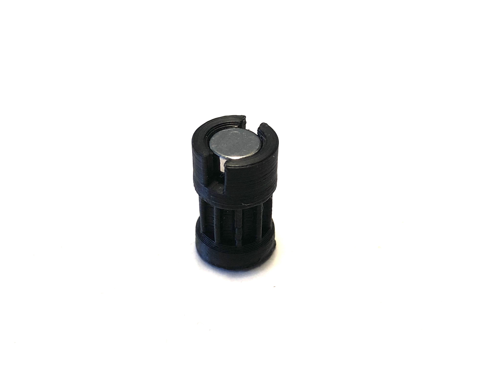
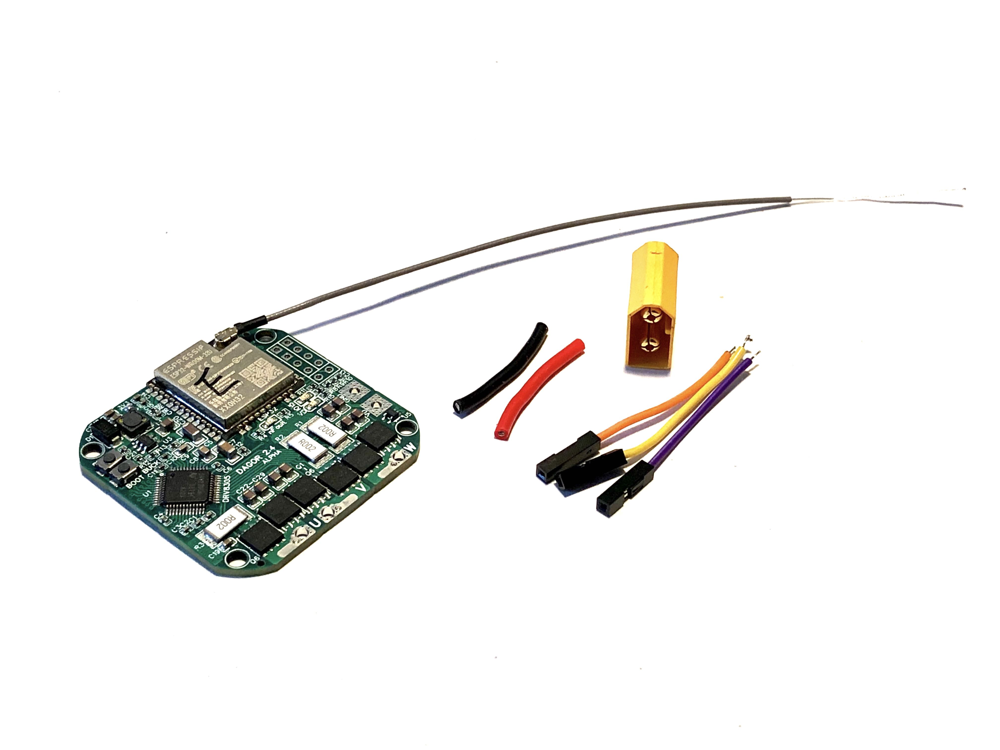
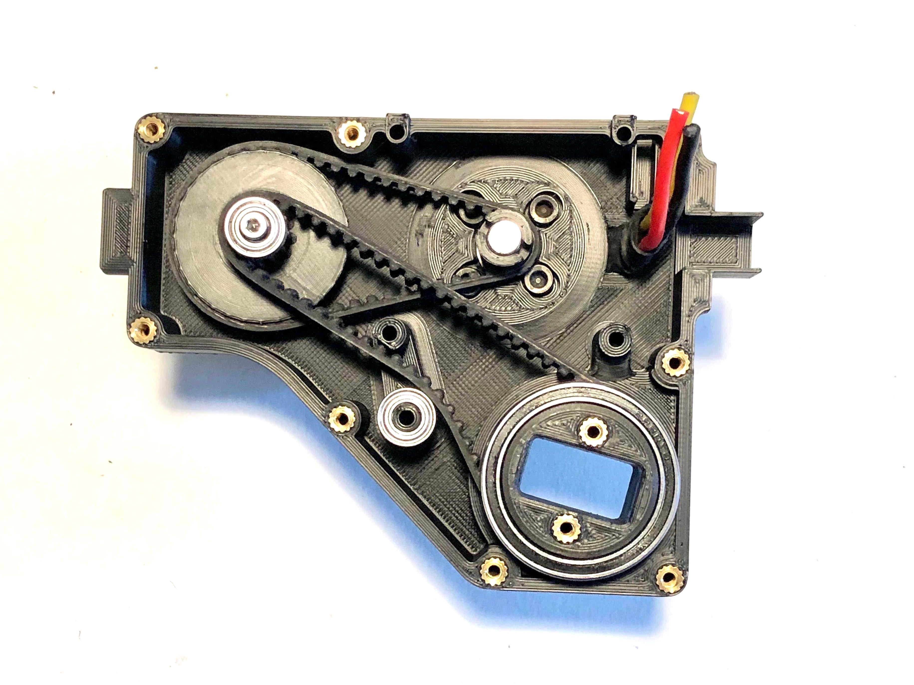

# dagor_biped_hardware

  

This is a robot hardware design based on the the [Open Robot Dynamic Initiative](https://github.com/open-dynamic-robot-initiative/open_robot_actuator_hardware) Bolt robot remixed for easier and cheaper assembly using commonly available FDM 3D printers and control via the [Dagor Brushless motor control module](https://www.dagor.dev). The following modifications were made to the original design:

  - The body and cover of the actuator modules are modified to make them print easily without supports on an entry level FDM printer in ASA/PLA.
  - Change of belt to 3M HTD profile. This curved belt profile might not be ideal in terms of backlash and other performance characteristics, but it is more affordable than the AT3 GENIII Conti belts used in the original ODRI work. Other (trapezoidal) tooth profiles might be better suited for this application.
  - Change of gear ratio from 1:9 to 1:8. This leads to slightly less torque but also faster speed. The change was made to accomodate a bigger transmission pulley with 12/32 instead of 10/30 teeth, which allows printing the pulley on an FDM printer in PLA.
  - Change to 4004 360kV budget motors. Change to mounting holes and design of custom Hex-based motor pulley to avoid having to make a custom motor shaft.
  - Mounting holes for [Dagor Brushless Controller module](https://www.dagor.dev). 

## Instructions

### Motor pulley

  

The motor pulley press-fits onto the brass or steel standoffs on the finished motor assembly. It is recommended to print the pulley with material that is a bit flexible (like TPE) for added durability.

### Output pulley

  

Two threaded inserts are placed on the output pulley and two 6705 bearings attached.

### Center pulley

  

The center transmission pulley is under a lot of stress and needs to be fabricated as strong as possible. In many other designs this pulley is machined from aluminium using CNC to avoid breaking it. It would also make sense to print it out of a strong material such as Nylon or Polycarbonate. To make this piece out of PLA, a few custom slicer settings need to be made for extra strength.

1. We printed the pulley with the maximum resolution of 0.08mm on an Ender 3 in PLA. This enables the underside of the pulley to print without supports.
2. Part cooling needs to be turned off during print except for the very top circular shape that connects to the bearing. In our case we turned on part cooling at layer 192. No part cooling increases layer adhesion significantly and is absolutely recommended. To make this work with enough precision we decreased the output perimeter speed to 5mm/s. 
3. The extrusion width needs to be optimized to avoid gaps between the tooth profile and inner body of the pulley. In our case the optimal extrusion width was 0.3mm for inner and outer perimeters.
4. We set the perimeter count to 32 so that the pulley prints entirely as perimeters with no infill. This maximizes the contact area between the bigger bottom pulley and smaller top pulley.
5. We set the extrusion multiplier to 105% to increase layer bonding even further.

After printing, a 20mm M2.5 bolt is screwed into the pulley to further strengthen it from top to bottom. Then the MR105 bearings can be press-fit into place.

### Preparing the motor shaft

  

There are M2.5 threads on the output shaft of the Sunnysky motors we used in this build. If you use other motors or receive another batch of these motors without the thread then you have to find another way of mounting the output transmission pulley onto your motors. This might involve replacing the shaft of the motor entirely (for examples see [here](https://github.com/open-dynamic-robot-initiative/open_robot_actuator_hardware/blob/master/mechanics/actuator_module_v1/details/details_motor_shaft_preparation.md) and [here](https://youtu.be/HwWZw7wfN_k?t=182)). In our case, the process is quite simple:

 1. Remove the original M2.5 lockscrew on the output shaft of the motor and seperate the outer case from the stator. Due to the magnetic force this requires quite a bit of strength. Be aware not to pinch your fingers.
 2. Use a hard flat surface to push the output shaft from the outer case a little bit. Apply Loctite 648 or another suitable anaerobic metal glue onto the surfaces and push the shaft back into the housing. Remove any residual glue that was squeezed out from the outside.
 3. Snap the stator back into the housing carefully. After apply some Loctite 648 to the M2.5 standoff and screw it into the shaft as tight as possible with pliers. We use steel standoffs here, but the more commonly available brass standoffs would probably also work.
 4. Wait for the Loctite to cure at least 24hr. Then slide the 3D printed motor output pulley over the standoff. It should be a very tight press-fit between the pulley and standoff.
 5. Finally insert the magnet used for the magnetic encoder into place. It should also be a pretty tight fit. If it falls out very easily apply a little amount of glue to fix it in place.

### Preparing Dagor boards

  

 1. Prepare a 3-pin female programming header connection cable with ~4cm length and put some solder on the exposed leads. Solder the programming wires on to RXD/TXD/GND on the Dagor board, with the leads exiting the PCB towards the side with the magnetic encoder. 
 2.  Prepare an XT60 male connector with ~2cm leads for the hip modules and a ~15cm power wire without a connector for the leg modules. Solder the power wires on the side of the module with the magnetic encoder.
 3. Optionally you could use bullet style connectors for the motor wires, but I choose to solder them onto the board directly after assembly. If you want to also solder directly just put some tin onto the pads of the controller. The leg modules have enough space for connectors but in the hip modules its a very tight fit.

### Actuator assembly

  

  

*Final weight of hip module: 188g*

Make sure that both the smaller MR105 and bigger 6705 bearings press fit tightly in their places!

1. Use a soldering iron to place 8x threaded inserts into the provided holes on the body of the actuator module.
2. Mount the finished motor assembly onto the body of the actuator module, feeding the wires through the hole. Dont worry about the length of the motor cables at this point.
3. Take the assembled transmission pulley and press it into the mounting hole while adding the 50 tooth belt between the motor and transmission pulleys. There will be some tension here and the transmission pulley will be slightly slanted towards the motor. That is ok. You can keep tension on the transmission pulley and give the motor a few turns to see if it is spinning freely.
4. Press fit an MR105 bearing onto the belt tensioning post in the body of the module. Make sure it sits flush with the bottom and be sure not to apply too much force to the post. It will be strengthened by a bolt in the final stage of assembly.
5. Place the output pulley assembly into its hole on the body while adding the 67 tooth belt between it and the transmission pulley. Quickly give the motor a few turns while keeping pressure on the transmission pulley to make sure the output pulley turns. Dont apply too much force to avoid breaking the belt tensioning post.
7. Place a Dagor board onto the mounting posts and screw in 4x M2.5 bolts to secure it.
8. Place the programming and power connectors into their sockets and glue them into place with either hotglue or superglue.
9. Shorten and solder the motor wires onto the Dagor board. Optionally you can use bullet style connectors for this.
10. Place the cover on top of the base. You need to slip it over one side of the Dagor board and wiggle both the transmission and output pulleys into place to make it work. The belt tension will make this a bit tricky, be patient and dont apply too much force.
11. Screw the 8x M2.5 10mm bolts into place securing everything.
12. Finally, screw one M2.5 20mm bolt into the hole of the belt tensioner. This is essential because otherwise the belt tensioning post will break off.
13. Check that everything runs smoothly by giving the motor a few turns and backdriving the actuator from the output shaft. After, flash the firmware on Dagor and begin testing.

## Bill of Materials

This is a preliminary list subject to change.

### 3D printed parts

| Name 							  | qty |
| --- | --- |
| hip_normal_body					| 2 |
| hip_normal_cover					| 2 |
| hip_mirrored_body					| 2 |
| hip_mirrored_cover				| 2 |
| upper_leg_structure_base			| 2 |
| upper_leg_structure_cover			| 2 |
| upper_leg_structure_output_shaft	| 2 |
| lower_leg_structure				| 2 |
| foot_structure					| 2 |
| body_structure					| 1 |
| motor_pulley						| 6 |
| transmission_pulley				| 6 |
| output_pulley						| 6 |

### Mechanical components

| Name 							| qty  |
| --- | --- |
| Belt 3M HTD 150mm/50t/4mm 	| 3    |
| Belt 3M HTD 201mm/67t/6mm		| 3    |
| Bearing 6705 25x32x4			| 12   |
| Bearing MR105 5x10x4			| 18   |
| M2.5 threaded inserts			| 48   |
| M2.5 x 10mm screw				| 48   |
| M2.5 x 20mm screw				| 16   |
| M2.5 distance bolt 10mm		| 6    |
| Motor encoder magnet   		| 6    |

### Electrical components

| Name 							| qty  |
| --- | --- |
| Dagor board 					| 6    |
| u.fl IPEX antenna  			| 6    |
| Sunnysky 5010 360kV motor		| 6    |
| XT60 male connector			| 6    |

